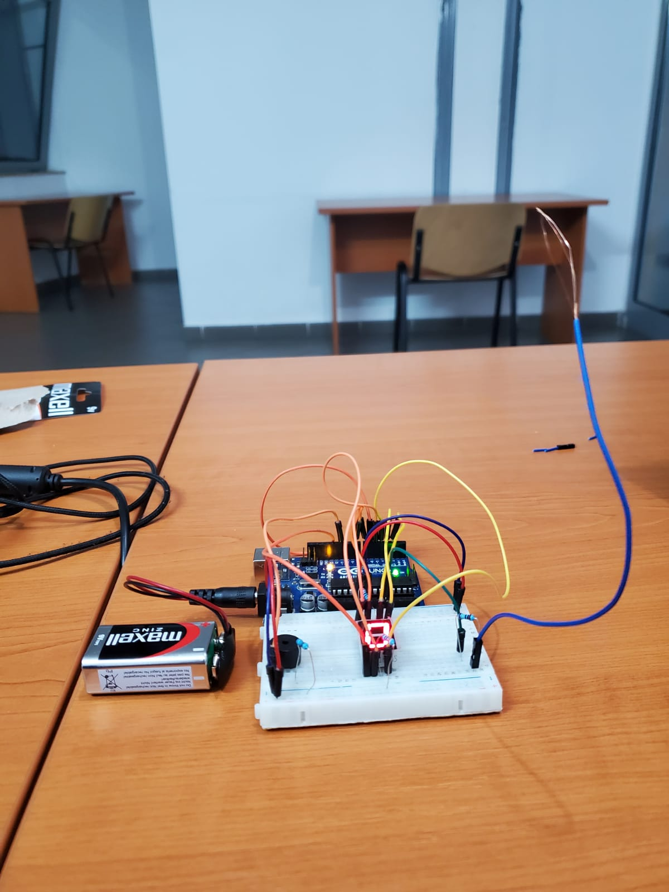
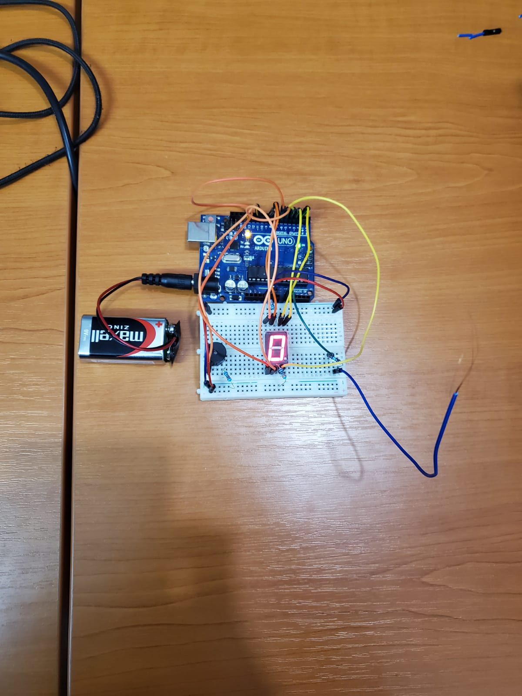
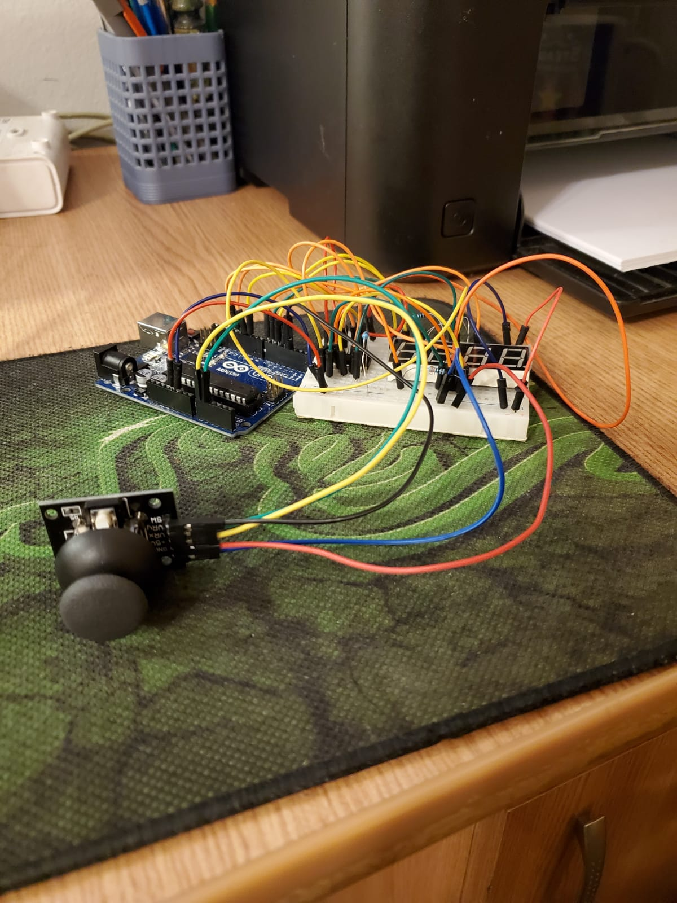
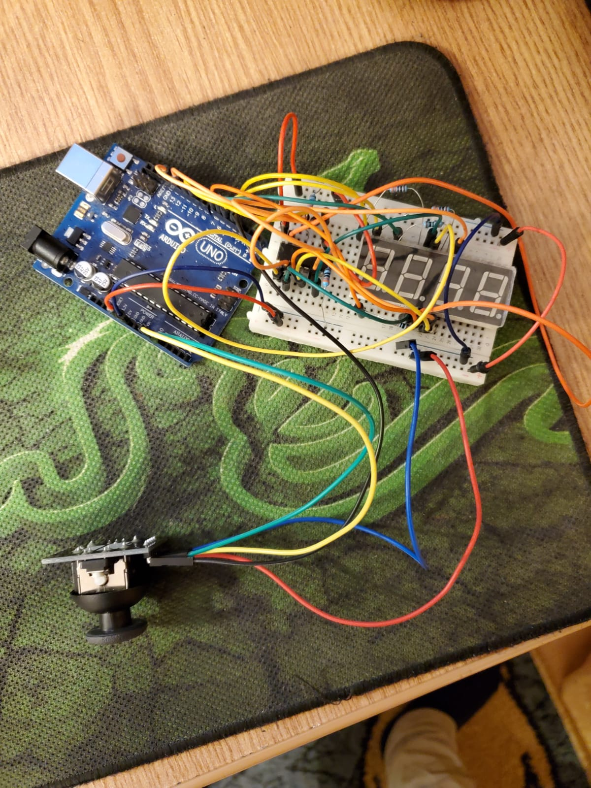

# Introduction to Robotics (2021 - 2022)

Introduction to Robotics laboratory homeworks, taken in the 3rd year at the Faculty of Mathematics and Computer Science, University of Bucharest. Each homework includes requirements, implementation details, code and image files.

 Homework 1 

### Requirements

- Use a separat potentiometer in controlling each of the color of the RGB led (Red,Green and Blue).  The control must be done with digital electronics(aka you must read the value of the potentiometer with Arduino, and write a mapped value to each of the pins connected to the led.

### Setup

### Demo

https://www.youtube.com/watch?v=SsmEDkxC4sU&ab_channel=AndreiBlahovici

 Homework2 

### Requirements

- Building  the  traffic  lights  for  a  crosswalk. You will use 2 LEDs to represent the traffic lights for people (red and green) and 3 LEDs to represent the traffic lights for cars (red, yellow and green). See the states it needs to go through.  If anything is not clear, ask.  Also, see the uploaded video (the intervals are different, but the states flow is the same). It’s a traffic lights system for people and cars - don’t overthink it.

- The system has the following states:

1. State 1 (default, reinstantiated after state 4 ends): green light for cars, red  light  for  people,  no  sounds.
	Duration:  indefinite,  changed  by pressing the button.

2. State 2 (initiated by counting down 10 seconds after a button press): the  light  should  be  yellow  for  cars,  red  for  people  and  no  sounds.
	Duration:  3 seconds.
3. State 3 (initiated after state 2 ends): red for cars, green for people and a beeping sound from the buzzer at a constant interval.
	Duration: 10 seconds.
4. State 4 (initiated after state 3 ends): red for cars, blinking green for people and a beeping sound from the buzzer,  at a constant interval,  faster than the beeping in state 3.  This state should last 5 seconds.

- Be  careful:  pressing  the  button  in  any  state  other  than  state  1  should NOT yield any actions.

### Setup

### Demo

https://www.youtube.com/shorts/fuSWmsdrpt0

 Homework 3 

### Requirements

Should detect EMF (check body and near outlets. DO NOT INSERT INTO OUTLET). It should print the value on the 7-segment display (or light the led bar) and should make a sound based on the intensity.

### Setup

### Demo

https://www.youtube.com/watch?v=Yhp4ss0zfhc&ab_channel=AndreiBlahovici

 Homework 4 

### Requirements

- First  state:   you  can  use  a  joystick  axis  to  cycle  through  the  4 digits; using the other axis does nothing.  A blinking decimal point shows the current digit position.  When pressing the button (must use interrupt for  maximum  points!),  you  lock  in  on  the  selected  digit  and  enter  the second state.

- Second state: In this state, the decimal point stays always on, no longer blinking and you can no longer use the axis to cycle through the 4 digits. Instead, using the other axis, you can increment or decrement the number on the current digit.  Pressing the button again returns you to the previous state.

- For bonus, save the last value in eeprom and load it when starting arduino. 	Also, keep in mind that when changing the number, you must increment it for 	each joystick movement - it should not work continuously increment if you keep 	the joystick in one position.

### Setup

### Demo

https://www.youtube.com/watch?v=BojKTMopTfY&ab_channel=AndreiBlahovici

